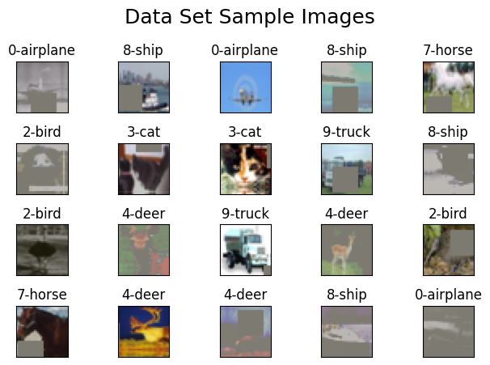
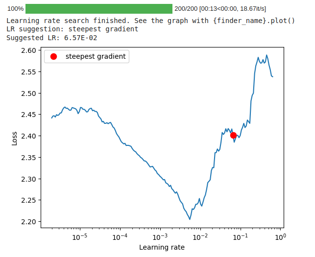
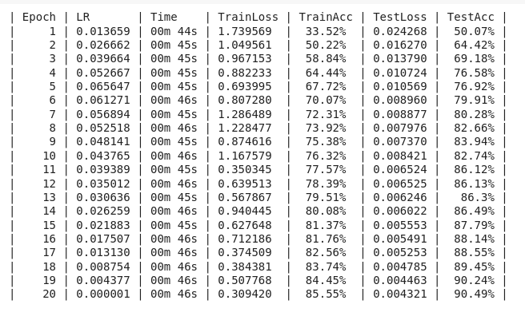
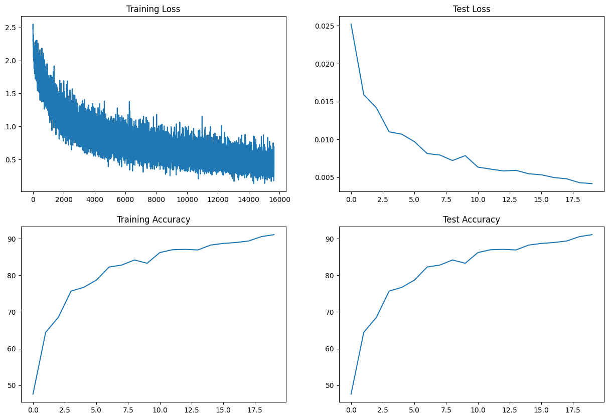
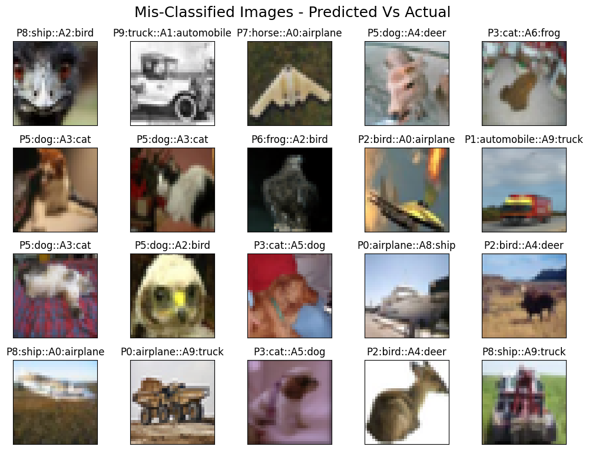
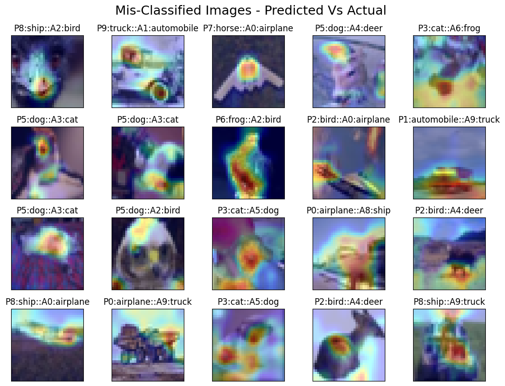

# S11
This is the repository for all the work done relating to ERA  S11 assignment

### 1. S11.ipynb

The `S11.ipynb` file is the notebook that has executions of training model based on the network architecture ResNet18 so as to execute the model which gives 85%+ accuracy by training the model for 20 epochs. It is to note here that we are not defining any new class or function here, rather using and executing the model framework defined in a separate repo and obtaining the results. The repo for the model framework code can be found at https://github.com/mHemaAP/model_framework. Please refer to [it's README](https://github.com/mHemaAP/model_framework/blob/main/README.md) for more details. 

#### 1.1. Descritpion of basic components in the notebook

This `S11.ipynb`file contain code for training and evaluating a neural network model using the CIFAR10 dataset. This contains a ResNet18 model training framework with utility functions for deep learning tasks. The framework is designed to work with the CIFAR-10 dataset, but it can be extended to other datasets as well. The code provided here demonstrates how to use the framework to train a deep learning model on the CIFAR-10 dataset, visualize training statistics, and analyze incorrect or mis-classified predictions using Grad-CAM visualizations. This file includes the following components:

- Clone the model_framework repository and install the required dependencies
- Importing necessary libraries and dependencies
- Display the sample CIFAR10 dataset images
- Display ResNet18 model summary
- Create an instance of the ResNet18 model training class using CrossEntropyLoss as the loss function, SGD as the optimizer and One Cycle Policy Learning Rate scheduler
- Run the training process 
- Display model train / test statistics
- Display mis-classified predictions with and without Grad-CAM visualizations


#### 1.2. Findings of training the model

**Results:**

- Parameters: 11,173,962 ~= 11.2M
- Best Learning Rate found - 6.57E-02
- Best Train Accuracy: 85.63%
- Best Test Accuracy: 91.09% (20th Epoch)
- Test Accuracy: 86.21% (11th Epoch) [First occurrence of test accuracy >= 85%]

**Analysis:**
- Model has no over fitting through out the training
- Model shows under-fitting performance
- Scheduling OneCycle LR with pct_start = 5/20 gave better train/test accuracies trend in the 20 epochs

Few samples in the dataset are shown below.



ResNet18 Model Summary is as follows,

```
=====================================================================================================================================================================
Layer (type:depth-idx)                   Input Shape               Output Shape              Param #                   Kernel Shape              Param %
=====================================================================================================================================================================
ResNet                                   [64, 3, 32, 32]           [64, 10]                  --                        --                             --
├─Conv2d: 1-1                            [64, 3, 32, 32]           [64, 64, 32, 32]          1,728                     [3, 3]                      0.02%
├─BatchNorm2d: 1-2                       [64, 64, 32, 32]          [64, 64, 32, 32]          128                       --                          0.00%
├─Sequential: 1-3                        [64, 64, 32, 32]          [64, 64, 32, 32]          --                        --                             --
│    └─BasicBlock: 2-1                   [64, 64, 32, 32]          [64, 64, 32, 32]          --                        --                             --
│    │    └─Conv2d: 3-1                  [64, 64, 32, 32]          [64, 64, 32, 32]          36,864                    [3, 3]                      0.33%
│    │    └─BatchNorm2d: 3-2             [64, 64, 32, 32]          [64, 64, 32, 32]          128                       --                          0.00%
│    │    └─Conv2d: 3-3                  [64, 64, 32, 32]          [64, 64, 32, 32]          36,864                    [3, 3]                      0.33%
│    │    └─BatchNorm2d: 3-4             [64, 64, 32, 32]          [64, 64, 32, 32]          128                       --                          0.00%
│    │    └─Sequential: 3-5              [64, 64, 32, 32]          [64, 64, 32, 32]          --                        --                             --
│    └─BasicBlock: 2-2                   [64, 64, 32, 32]          [64, 64, 32, 32]          --                        --                             --
│    │    └─Conv2d: 3-6                  [64, 64, 32, 32]          [64, 64, 32, 32]          36,864                    [3, 3]                      0.33%
│    │    └─BatchNorm2d: 3-7             [64, 64, 32, 32]          [64, 64, 32, 32]          128                       --                          0.00%
│    │    └─Conv2d: 3-8                  [64, 64, 32, 32]          [64, 64, 32, 32]          36,864                    [3, 3]                      0.33%
│    │    └─BatchNorm2d: 3-9             [64, 64, 32, 32]          [64, 64, 32, 32]          128                       --                          0.00%
│    │    └─Sequential: 3-10             [64, 64, 32, 32]          [64, 64, 32, 32]          --                        --                             --
├─Sequential: 1-4                        [64, 64, 32, 32]          [64, 128, 16, 16]         --                        --                             --
│    └─BasicBlock: 2-3                   [64, 64, 32, 32]          [64, 128, 16, 16]         --                        --                             --
│    │    └─Conv2d: 3-11                 [64, 64, 32, 32]          [64, 128, 16, 16]         73,728                    [3, 3]                      0.66%
│    │    └─BatchNorm2d: 3-12            [64, 128, 16, 16]         [64, 128, 16, 16]         256                       --                          0.00%
│    │    └─Conv2d: 3-13                 [64, 128, 16, 16]         [64, 128, 16, 16]         147,456                   [3, 3]                      1.32%
│    │    └─BatchNorm2d: 3-14            [64, 128, 16, 16]         [64, 128, 16, 16]         256                       --                          0.00%
│    │    └─Sequential: 3-15             [64, 64, 32, 32]          [64, 128, 16, 16]         --                        --                             --
│    │    │    └─Conv2d: 4-1             [64, 64, 32, 32]          [64, 128, 16, 16]         8,192                     [1, 1]                      0.07%
│    │    │    └─BatchNorm2d: 4-2        [64, 128, 16, 16]         [64, 128, 16, 16]         256                       --                          0.00%
│    └─BasicBlock: 2-4                   [64, 128, 16, 16]         [64, 128, 16, 16]         --                        --                             --
│    │    └─Conv2d: 3-16                 [64, 128, 16, 16]         [64, 128, 16, 16]         147,456                   [3, 3]                      1.32%
│    │    └─BatchNorm2d: 3-17            [64, 128, 16, 16]         [64, 128, 16, 16]         256                       --                          0.00%
│    │    └─Conv2d: 3-18                 [64, 128, 16, 16]         [64, 128, 16, 16]         147,456                   [3, 3]                      1.32%
│    │    └─BatchNorm2d: 3-19            [64, 128, 16, 16]         [64, 128, 16, 16]         256                       --                          0.00%
│    │    └─Sequential: 3-20             [64, 128, 16, 16]         [64, 128, 16, 16]         --                        --                             --
├─Sequential: 1-5                        [64, 128, 16, 16]         [64, 256, 8, 8]           --                        --                             --
│    └─BasicBlock: 2-5                   [64, 128, 16, 16]         [64, 256, 8, 8]           --                        --                             --
│    │    └─Conv2d: 3-21                 [64, 128, 16, 16]         [64, 256, 8, 8]           294,912                   [3, 3]                      2.64%
│    │    └─BatchNorm2d: 3-22            [64, 256, 8, 8]           [64, 256, 8, 8]           512                       --                          0.00%
│    │    └─Conv2d: 3-23                 [64, 256, 8, 8]           [64, 256, 8, 8]           589,824                   [3, 3]                      5.28%
│    │    └─BatchNorm2d: 3-24            [64, 256, 8, 8]           [64, 256, 8, 8]           512                       --                          0.00%
│    │    └─Sequential: 3-25             [64, 128, 16, 16]         [64, 256, 8, 8]           --                        --                             --
│    │    │    └─Conv2d: 4-3             [64, 128, 16, 16]         [64, 256, 8, 8]           32,768                    [1, 1]                      0.29%
│    │    │    └─BatchNorm2d: 4-4        [64, 256, 8, 8]           [64, 256, 8, 8]           512                       --                          0.00%
│    └─BasicBlock: 2-6                   [64, 256, 8, 8]           [64, 256, 8, 8]           --                        --                             --
│    │    └─Conv2d: 3-26                 [64, 256, 8, 8]           [64, 256, 8, 8]           589,824                   [3, 3]                      5.28%
│    │    └─BatchNorm2d: 3-27            [64, 256, 8, 8]           [64, 256, 8, 8]           512                       --                          0.00%
│    │    └─Conv2d: 3-28                 [64, 256, 8, 8]           [64, 256, 8, 8]           589,824                   [3, 3]                      5.28%
│    │    └─BatchNorm2d: 3-29            [64, 256, 8, 8]           [64, 256, 8, 8]           512                       --                          0.00%
│    │    └─Sequential: 3-30             [64, 256, 8, 8]           [64, 256, 8, 8]           --                        --                             --
├─Sequential: 1-6                        [64, 256, 8, 8]           [64, 512, 4, 4]           --                        --                             --
│    └─BasicBlock: 2-7                   [64, 256, 8, 8]           [64, 512, 4, 4]           --                        --                             --
│    │    └─Conv2d: 3-31                 [64, 256, 8, 8]           [64, 512, 4, 4]           1,179,648                 [3, 3]                     10.56%
│    │    └─BatchNorm2d: 3-32            [64, 512, 4, 4]           [64, 512, 4, 4]           1,024                     --                          0.01%
│    │    └─Conv2d: 3-33                 [64, 512, 4, 4]           [64, 512, 4, 4]           2,359,296                 [3, 3]                     21.11%
│    │    └─BatchNorm2d: 3-34            [64, 512, 4, 4]           [64, 512, 4, 4]           1,024                     --                          0.01%
│    │    └─Sequential: 3-35             [64, 256, 8, 8]           [64, 512, 4, 4]           --                        --                             --
│    │    │    └─Conv2d: 4-5             [64, 256, 8, 8]           [64, 512, 4, 4]           131,072                   [1, 1]                      1.17%
│    │    │    └─BatchNorm2d: 4-6        [64, 512, 4, 4]           [64, 512, 4, 4]           1,024                     --                          0.01%
│    └─BasicBlock: 2-8                   [64, 512, 4, 4]           [64, 512, 4, 4]           --                        --                             --
│    │    └─Conv2d: 3-36                 [64, 512, 4, 4]           [64, 512, 4, 4]           2,359,296                 [3, 3]                     21.11%
│    │    └─BatchNorm2d: 3-37            [64, 512, 4, 4]           [64, 512, 4, 4]           1,024                     --                          0.01%
│    │    └─Conv2d: 3-38                 [64, 512, 4, 4]           [64, 512, 4, 4]           2,359,296                 [3, 3]                     21.11%
│    │    └─BatchNorm2d: 3-39            [64, 512, 4, 4]           [64, 512, 4, 4]           1,024                     --                          0.01%
│    │    └─Sequential: 3-40             [64, 512, 4, 4]           [64, 512, 4, 4]           --                        --                             --
├─Linear: 1-7                            [64, 512]                 [64, 10]                  5,130                     --                          0.05%
=====================================================================================================================================================================
Total params: 11,173,962
Trainable params: 11,173,962
Non-trainable params: 0
Total mult-adds (G): 35.55
=====================================================================================================================================================================
Input size (MB): 0.79
Forward/backward pass size (MB): 629.15
Params size (MB): 44.70
Estimated Total Size (MB): 674.63
=====================================================================================================================================================================
```


The following is the learning rate finder curve while determining the optimal LR value



The train log per epoch is as follows




#### 1.3. Graphs of the Model Statistics [Best Model plots shown below]

The following model statistics for the normalization techniques tried. These plots pertain to the performance of the final optimal model using architecture ResNet18 and the other model specifics are highlighted below



#### 1.4. Collection of Mis-classified Predictions

The following image collection shows the mis-classified predictions for the normalization techniques tried. These images pertain to the predictions made by the final optimal model (in S11.ipynb) using architecture Net and the other model specifics are highlighted below



#### 1.5 Collection of Mis-classified Predictions with GradCAM 

The following is the image collection of the mis-classified predictions with Grad CAM technique applied using the relevant library. Here GradCAM is using channels of size 8x8 from layer 3 of Resnet18 (as the output of layer 4 gives 4x4 channel size)




## Usage

To run the project, open the S11.ipynb in github and click on the "Open in Colab" icon in the ipynb file to open the file in Google Colab and start executing the cells of the notebook. The installation of the required dependencies is taken care by executing the following cell of the notebook. 
```
!pip install -qr requirements.txt
```
We can execute the `S11.ipynb` notebook to perform the training and testing. Adjust the parameters such as dropout, number of epochs to improve the model performance as desired.

Please note that this README serves as a placeholder. As I make further modifications to the project, I would keep this file updated accordingly. 

For more detailed information on the project's implementation and code, please refer to the individual files mentioned above.
